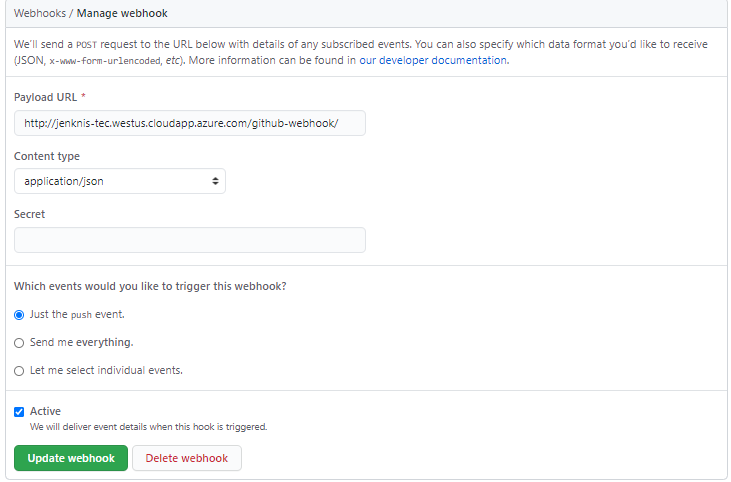

# Basic Training for DevOps
Este repositorio contiene el codigo base para automatizar el testing de un programa utilizando jenkins

### Resultados esperedos:
- Iniciar un build al realizar un evento de push en Github
- Correr pruebas unitarias en pytest
- Realizar un analysis estatico del codigo utilizando SonarQube

### 1. Configurar el webhook
Un webhook envia un mensaje cuando ocurre un evento especifico en github. Esto se puede utilizar para iniciar
trabajos de jenkins automaticamente. Los pasos a seguir son los siguientes
- Ve a la seccion de Settings/Webhooks-Add Weebhooks
- Insertar contraseña si se solicita
- Coloca http://jenknis-tec.westus.cloudapp.azure.com/github-webhook/ en el campo **Payload URL**
- Selecciona application/json en el campo **Payload URL**
- La configuracion final es la siguiente

- Por ultimo guarda la configuracion

### 2. Crear un jenkins job
En jenkins podemos automatizar nuestro proceso de desarrollo utilizando jobs. Cada jobs consiste en un set de pasos 
que ejecutara el servidor, esto se puede utilizar para realizar testing cada que se genera un cambio en un rama, para garantizar la estabilidad del software antes de hacer un deployment e incluso realizar un deployment de manera automatica.

Para realizar un  jenkins job debemos crear un archivo llamado **jenkinsfile**
En este jenkins file especificaremos en que nodo debe correr nuestro job en este caso es el nodo **principal**.
~~~
//tell jenkins this is a pipeline
pipeline {

    //Determine in which node will the pipeline be executed
    node("principal") {
     
    }
}
~~~

Los jobs se dividen en stages cada stage es un paso secuencial en nuestro job. Definiremos 3 stages para automatizar el testing de nuestro codigo en python.

Instalamos las dependencias de nuestro proyecto
~~~
stage('before') {
                steps {
                    sh 'python --version'
                    sh 'pip install -r requirements.txt'
                }
~~~

Ejecutamos 
~~~
stage('build') {
                steps {
                    sh 'python src/main.py'
                }
            }
~~~

Ejecutamos los tests a nuestro programa
~~~
stage('test') {
                steps {
                    sh 'tox'
                }
            }
~~~

El jenkins file resultante es el siguiente
~~~
//Determine in which node will the pipeline be executed

pipeline {
    //Determine in which node will the pipeline be executed
    node("principal") {
        stages {
            stage('before') {
                steps {
                    sh 'python --version'
                    sh 'pip install -r requirements.txt'
                }
            stage('build') {
                steps {
                    sh 'python src/main.py'
                }
            }
            stage('test') {
                steps {
                    sh 'tox'
                }
            }
        }
    }
}
~~~

#### En la seccion general

- Crea una nueva tarea de tipo multibranch pipeline 

- El name de tu tarea sera **NombreApellido**
- Seleccion Pipeline y presiona el boton de ok

- Activa la casilla esta ejecucion debe parametrizarse
- Agrega un parametro de tipo booleano con la siguiente configuracion

- Activa la casilla de github project e inserta el url de este repositorio
~~~
https://github.com/charlie83Gs/DevOpsBasicTrainingTec
~~~
#### En la seccion Build Triggers
Estos son los eventos que pueden iniciar automaticamente nuestra tarea.
Seleccionaremos la opcion: 

Esto permitira que nuestra tarea se active al realizar un push a nuestro repositorio

#### En la seccion Pipeline
- Seleccionamos pipeline script from SCM
- Indicamos el repositorio https://github.com/charlie83Gs/DevOpsBasicTrainingTec
- En branches to build indicamos nuestra rama NombreAppellido

