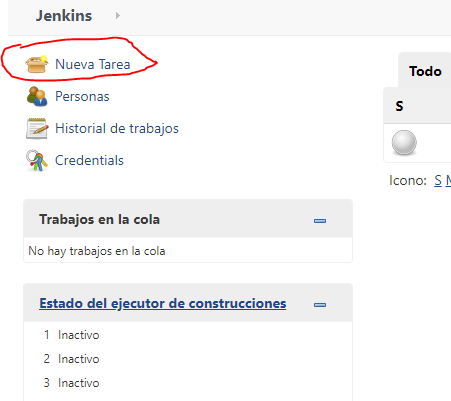
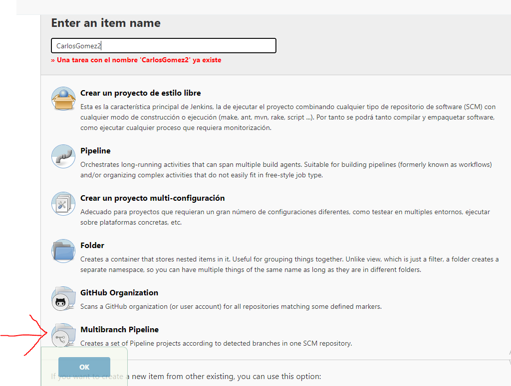
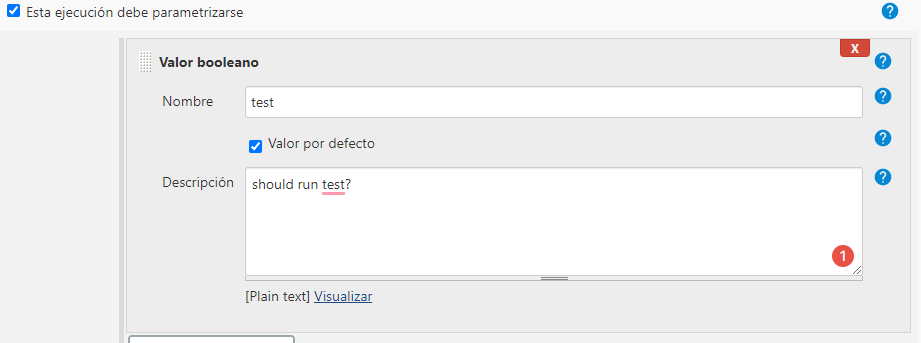
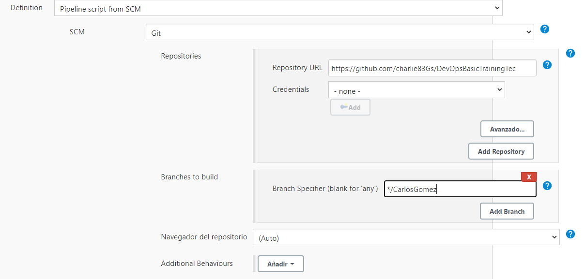
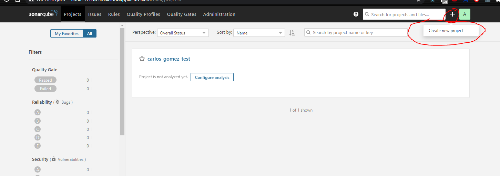
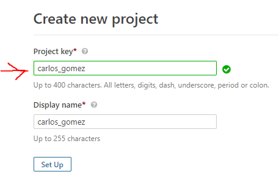

# Basic Training for DevOps
Este repositorio contiene el código base para automatizar el testing de un programa utilizando jenkins
 
### Resultados esperados:
- Correr pruebas unitarias en pytest de manera automática con jenkins
- Realizar un análisis estático del código utilizando SonarQube
 
 
### 1. Crear un jenkins job
En jenkins podemos automatizar nuestro proceso de desarrollo utilizando jobs. Cada jobs consiste en un set de pasos 
que ejecutará el servidor, esto se puede utilizar para realizar testing cada que se genera un cambio en un rama, para garantizar la estabilidad del software antes de hacer un deployment e incluso realizar un deployment de manera automática.
 
 
Para realizar un  jenkins job debemos crear un archivo llamado **jenkinsfile**
En este jenkins file especificaremos en qué nodo debe correr nuestro job en este caso es el nodo **principal**.
~~~
//tell jenkins this is a pipeline
pipeline {
 
    //Determine in which node will the pipeline be executed
    agent any
     
    }
}
~~~
 
Los jobs se dividen en stages cada stage es un paso secuencial en nuestro job. Definiremos 3 stages para automatizar el testing de nuestro codigo en python.
 
 
Instalamos las dependencias de nuestro proyecto
~~~
                stage('before') {
                steps {
                    sh 'python3 --version'
                    sh 'pip3 install -r requirements.txt'
                }
            }
~~~
 
 
Ejecutamos 
~~~
//add build step on tox
            stage('build') {
                steps {
                    sh 'python3 -m tox -e build'
                }
            }
~~~
 
 
Ejecutamos los tests a nuestro programa, este stage se puede controlar mediante parámetros
~~~
stage('test') {
                when{
                    //only execute tests is test parameter is true
                    expression { params.test == true }
                }
                steps {
                    sh 'python3 -m tox -e test'
                }
            }
~~~
 
El jenkins file resultante es el siguiente
~~~
pipeline {
    //execute in specific docker container
    //agent { docker { image 'python:3.7.2' } }
    //execute in any available agent
    agent any
    //Determine in which node will the pipeline be executed
 
    stages {
            stage('before') {
                steps {
                    sh 'python3 --version'
                    sh 'pip3 install -r requirements.txt'
                }
            }
            //add build step on tox
            stage('build') {
                steps {
                    sh 'python3 -m tox -e build'
                }
            }
            stage('test') {
                when{
                    //only execute tests is test parameter is true
                    expression { params.test == true }
                }
                steps {
                    sh 'python3 -m tox -e test'
                }
            }
        
    }
    
}
~~~
 
#### En la sección general
- Visitar el sitio de [jenkins](jenknis-tec.westus.cloudapp.azure.com)
- Crea una nueva tarea de tipo  pipeline 

 
- El name de tu tarea sera **NombreApellido**
- Selección Pipeline y presiona el botón de ok

- Activa la casilla esta ejecución debe parametrizarse
- Agrega un parámetro de tipo booleano con la siguiente configuracion

- Activa la casilla de github project e inserta el url de este repositorio
~~~
https://github.com/charlie83Gs/DevOpsBasicTrainingTec
~~~
#### En la seccion Build Triggers
Estos son los eventos que pueden iniciar automáticamente nuestra tarea.
Seleccionaremos la opción: 

Esto permitirá que nuestra tarea se active al realizar un push a nuestro repositorio
 
#### En la sección Pipeline
- Seleccionamos pipeline script from SCM
- Indicamos el repositorio https://github.com/charlie83Gs/DevOpsBasicTrainingTec
- En branches to build indicamos nuestra rama NombreAppellido

 
 
### 2. Analizar el código utilizando SonarQube
 
#### 2.1 Actualizar el pipeline de jenkins
Para tomar ventaja de SonarQube en nuestro pipeline vamos a modificar el jenkins agregando un nuevo stage
 
~~~
stage('SonarQube analysis') {
                steps {
                    script{
                        def scannerHome = tool 'SonarScanner';
                        withSonarQubeEnv('sonar') { // If you have configured more than one global server connection, you can specify its name
                            sh "${scannerHome}/bin/sonar-scanner"
                        }
                    }
                }
~~~
 
#### 2.2 Crear un nuevo proyecto en SonarQube
Sigue los siguientes pasos para crear un nuevo proyecto.
- Abre la pagina de SonarQube [sonar link](http://sonar-tec.westus.cloudapp.azure.com:9000/)
- Inicia sesión con los siguientes credenciales **tec** and password **$1234$**
- Crea un proyecto con la siguiente llave **nombre_apellido**

 
#### 2.3 Crear un archivo de sonar-project.properties
El archivo de sonar-project.properties lo utiliza jenkins para realizar el análisis de código de tu proyecto.
- Crear un archivo sonar-project.properties en la razi del repositorio
- Agrega las siguientes líneas en el archivo
~~~
sonar.projectKey=nombre_apellido
sonar.sources=.
~~~
- Actualiza el repositorio
 
#### 2.4 Realiza una análisis estático
- Visita la [pagina de Jenkins](http://jenknis-tec.westus.cloudapp.azure.com/) y ejecuta tu build
- Visita el [portal de SonarQube](http://sonar-tec.westus.cloudapp.azure.com:9000/) y revisa el resultado del análisis de código
